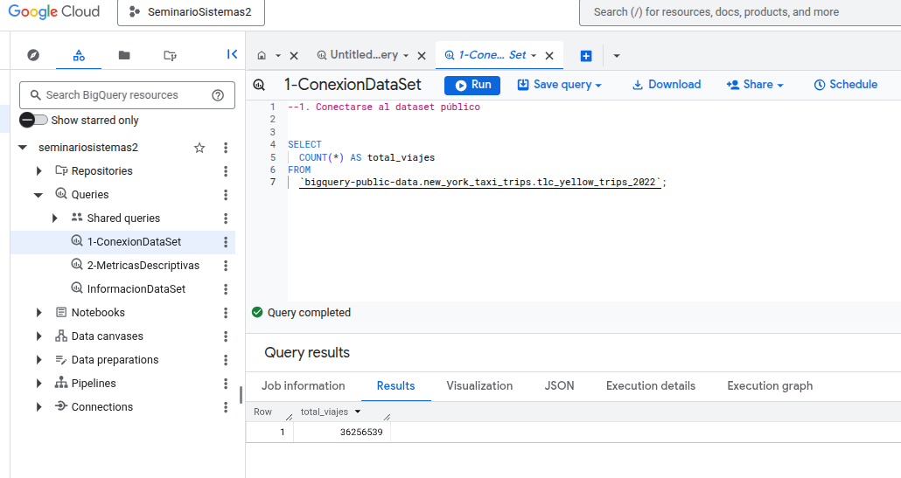
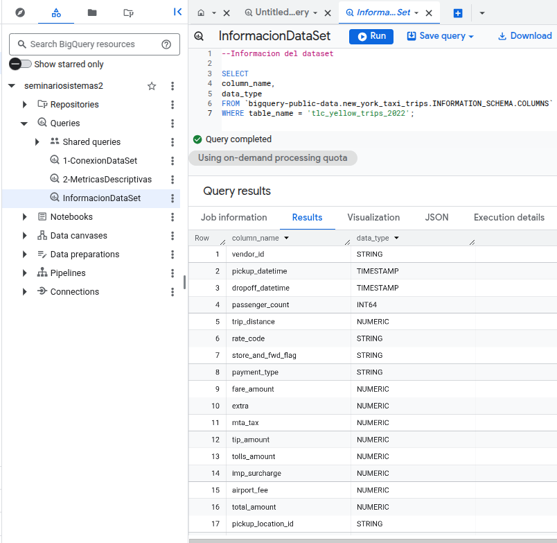
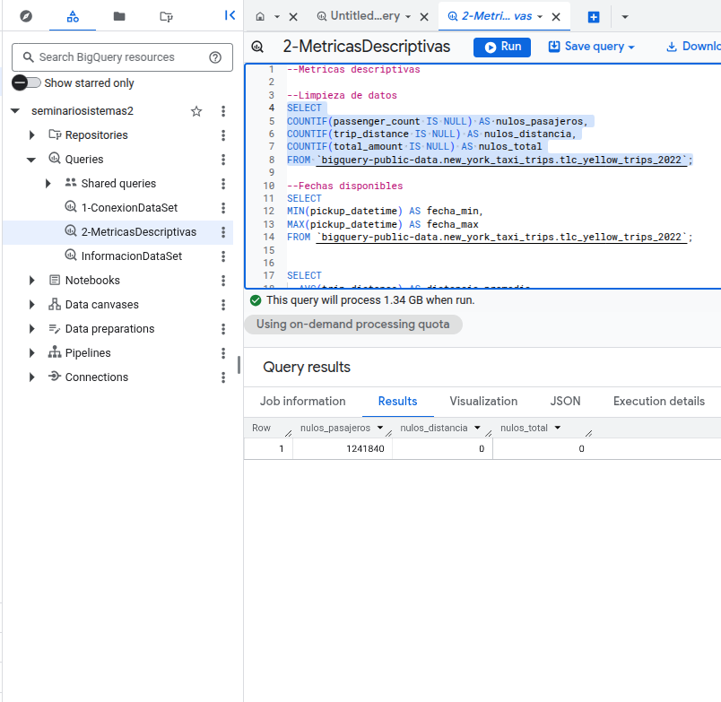

# Seminario de sistemas 2, Proyecto Fase 1

## 1. Conectarse al dataset público:

1. Entra a [Google Cloud Console](https://console.cloud.google.com/) e inicia sesión.
2. Crear nuevo proyecto,  **Project selector** → **New Project**
3. SELECT al Data Set

<div align="center">
  
</div>

## 2.Realizar consultas SQL 

### -Información del dataset

Ejecutamos la siguente consulta para revisar la información de las columnas y sus tipos de datos:

   ```sql
    SELECT
        column_name,
        data_type
    FROM `bigquery-public-data.new_york_taxi_trips.INFORMATION_SCHEMA.COLUMNS`
        WHERE table_name = 'tlc_yellow_trips_2022';
   ```


<div align="center">
  
</div>

### -Limpieza de datos

Ejecutamos la siguente consulta para revisar la limpieza de los datos:

   ```sql
    SELECT
        COUNTIF(passenger_count IS NULL) AS nulos_pasajeros,
        COUNTIF(trip_distance IS NULL) AS nulos_distancia,
        COUNTIF(total_amount IS NULL) AS nulos_total
    FROM `bigquery-public-data.new_york_taxi_trips.tlc_yellow_trips_2022`;
   ```


<div align="center">
  
</div>